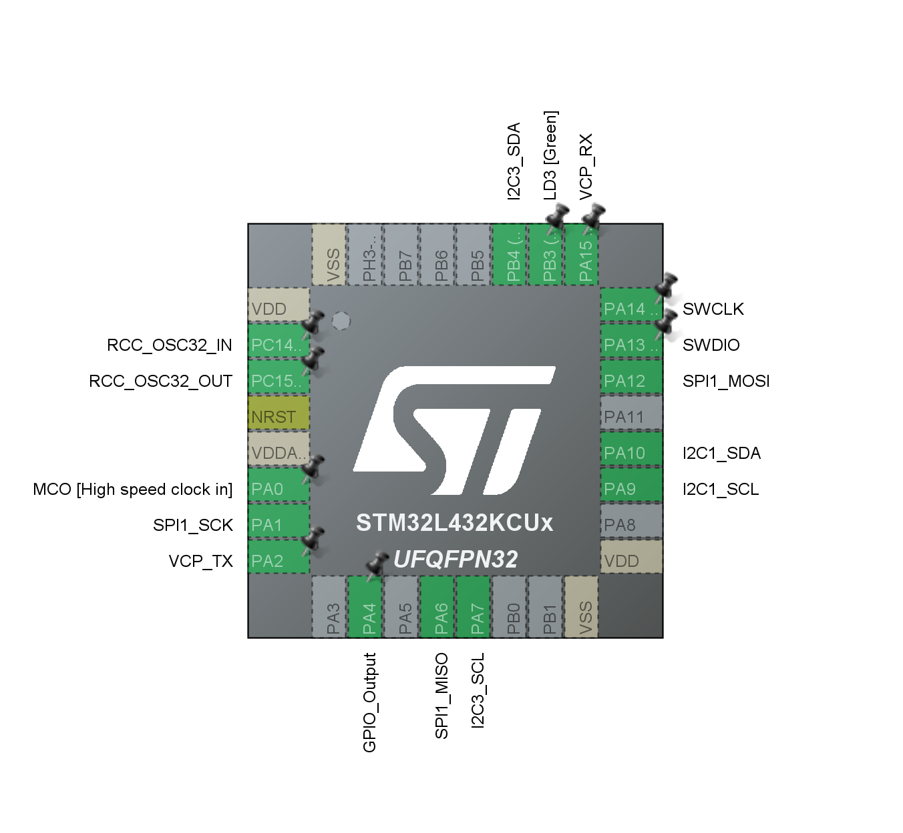

lichtkrant:
vcc     -> 3.3v
GND     -> GND
DIN     -> D2
CS      -> A4
CLK     -> A1

sensor:
VIN     -> 3.3v
GND     -> GND
SCL     -> A8
SDA     -> D12

I2C1 aan

I2C2 aan

SPI1 aan
    
PA4 -> gpio out

